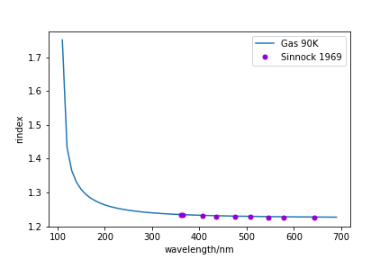
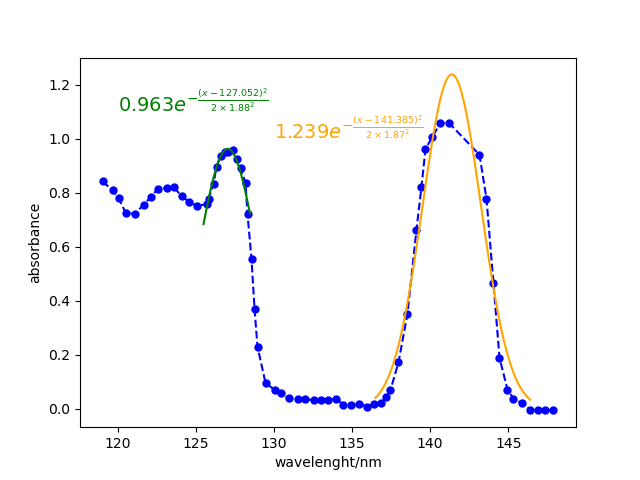
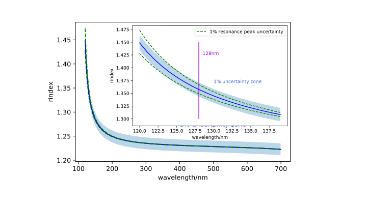
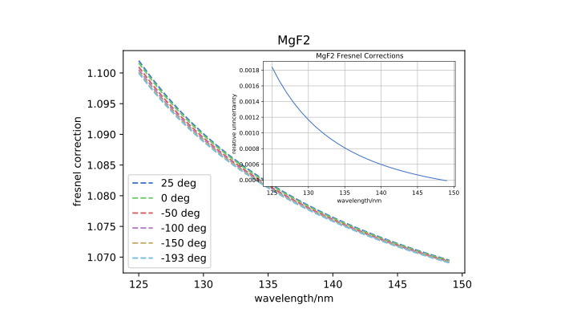
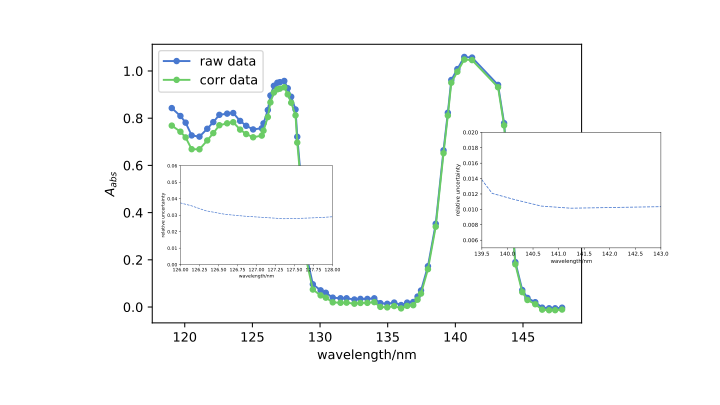
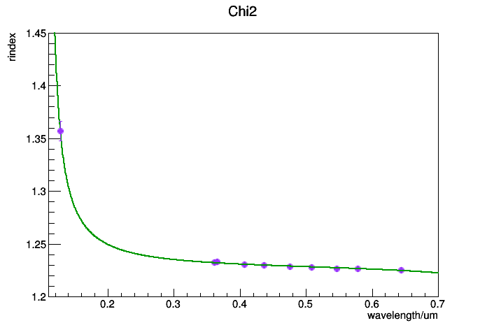
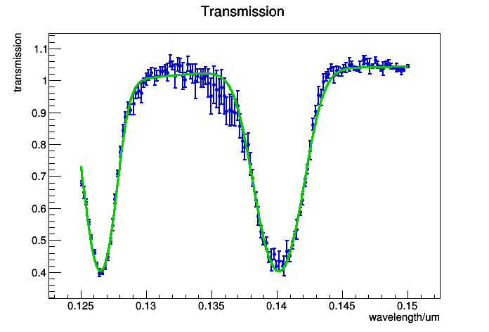

[toc]

# 液氩研究总结
`于淼 2020.11`

## 1. 测量数据总结

- **1969 Sinnock测量可见光波段的固体/液体argon**：

|     文章     | 温度 (K) | 压强 | 密度 ($10^{-2}mol/ml$) | 波长(nm) | 物理量 |
| :----------: | :------: | :--: | :--------------------: | :------: | :----: |
| 1969 Sinnock |  83.81   |  No  |         3.549          | 360-650  | 折射率 |
| 1969 Sinnock |    86    |  No  |         3.513          | 360-650  | 折射率 |
| 1969 Sinnock |    88    |  No  |         3.481          | 360-650  | 折射率 |
| 1969 Sinnock |    90    |  No  |         3.449          | 360-650  | 折射率 |

- **1980 A. Bideau-Mehu测量140.4-253.7nm气态argon折射率、强度和波长：**

|        文章         | 温度 (摄氏度) |  压强   | 密度 ($10^{-2}mol/ml$) |  波长(nm)   |           物理量           |
| :-----------------: | :-----------: | :-----: | :--------------------: | :---------: | :------------------------: |
| 1980 A. Bideau-Mehu |       0       | 760Torr |           No           | 140.4-253.7 | 折射率，振子强度，特征波长 |

- **1986 Laporte通过测量反射率和模型给出强度和波长：**

|     文章     | 温度 (摄氏度) | 压强 | 密度 ($10^{21}/ml$) | 波长(nm)  | 物理量 |
| :----------: | :-----------: | :--: | :-----------------: | :-------: | :----: |
| 1986 Laporte |     86.8      |  No  |        21.1         | ～ 99-112 | 反射率 |

测量密度从$0.425\times 10^{21}cm^{-3} \rightarrow 24.8\times 10^{21}cm^{-3}$。在最低密度的两个状态里，可以观察到两个原子共振线引起的peak($3p^54s ^1P_1, 3p^54s ^3P_1$)。随着密度增大，第二共振峰高能部分出现宽的吸收带，第一共振峰附近也出现宽的吸收带。

- **2012 Neumeier 测量液氩在118-140nm波段透射率**

|     文章      | 温度 (摄氏度) | 压强 | 密度 ($10^{21}/ml$) |  波长(nm)  |  物理量  |
| :-----------: | :-----------: | :--: | :-----------------: | :--------: | :------: |
| 2012 Neumeier |               |      |                     | ～ 118-140 | 衰减长度 |

- **2020 Babicz等人通过测量90K下128nm的群速度给出折射率和散射长度**

$\frac{1}{v_g} =7.46\pm0.03ns/m$.

## 2. 折射率理论模型

### 1）Lorentz-Lorenz 模型

$\boldsymbol E_{eff}(\boldsymbol r, t) = \boldsymbol E(\boldsymbol r, t) + \frac{4\pi}{3} P(\boldsymbol r, t)$

在线性，均匀分布，各向同性的的材料中，每个分子的电偶极矩可以表示为：

$\boldsymbol p(\boldsymbol r, t) = \int_{-\infin}^t\hat\alpha(t-t') \boldsymbol E_{eff}(\boldsymbol r, t') dt'$

经过傅里叶变换后：$\tilde{\boldsymbol p }(\boldsymbol r, \omega) = \hat\alpha(\omega) \boldsymbol E_{eff}(\boldsymbol r, \omega)$.   $\alpha(\omega)$是平均的极化。 如果N为分子数密度，则总的极化率为$\tilde{\boldsymbol P}(\boldsymbol r, \omega) = N \tilde{\boldsymbol p}(\boldsymbol r, \omega)$ . 则有 $\tilde{\boldsymbol P}(\boldsymbol r, \omega)=\chi_e(\omega)\tilde{\boldsymbol E}(\boldsymbol r , \omega)$. 其中电极化率$\chi_e(\omega) = \frac{N\alpha(\omega)}{1-(4\pi/3)N\alpha(\omega)}$, 对于相对介电常数有 $\epsilon(\omega) = 1 + 4\pi \chi_e(\omega)$

则可以得到Lorentz-Lorenz公式：
$$
\frac{\epsilon-1}{\epsilon+2} = \frac{4\pi N \alpha}{3}
\tag{1}
$$

### 2) 介电常数和波长的关系

将电介质中的电子的运动考虑成一个阻尼振荡，其运动方程为：
$$
m\frac{d^2x}{dt^2} = F_{constrain} + F_{dump} + F_{driven} \\
F_{dump} = -m\gamma \frac{dx}{dt} \\
F_{driven} = qE\cos(\omega t)  [exteranl field]
\tag{2}
$$
可解ode得到电极化强度：$\tilde{\boldsymbol P} = \frac{Nq^2}{m} (\sum_i \frac{f_i}{\omega_i^2-\omega^2-i\gamma\omega})\tilde{\boldsymbol E} $. 根据$\tilde{\boldsymbol P} = \epsilon_0 \tilde{\chi_e}\tilde{\boldsymbol E}$ , 可以得到：
$$
\tilde{\epsilon_r} = 1 + \frac{Nq^2}{m\epsilon_0}\sum_i\frac{f_i}{\omega_i^2-\omega^2-i\gamma\omega}
\tag{3}
$$
在色散介质中，通过解平面波的薛定谔方程可以得到折射率和衰减系数。（参考Griffth电动力学）

### 3) 液氩闪烁机制

电离激发液氩的发光谱会随着液氩的密度变化。对于稀薄的气体，被激发的原子大概率直接退激发到基态，对应的发射谱线为104.8nm和106.6nm。随着物质密度增大，被激发的原子与另一个基态原子碰撞的概率增大，从而形成一个双原子分子。

### 4) 液氩折射率公式

根据Lorentz-Lorenz公式，在远离共振峰处，阻尼可以忽略，折射率可以简化为：
$$
\frac{n^2-1}{n^2+2}=\frac{Ne^2}{12\pi^2\epsilon_0 mc^2}\sum_i \frac {f_i}{\lambda_i^{-2}-\lambda^{-2}}
\tag{4}
$$
对于液氩，发射谱在128nm处，而两个共振峰对应于104.8nm和106.6nm，第三项是其余所有跃迁总的贡献，因此可以表示如下：
$$
\frac{n^2-1}{n^2+2} = 1.2055\times10^{-2}\frac{2}{3}\frac{N_l}{N_g}\left(\frac{0.2075}{91.012-\lambda^{-2}} + \frac{0.0415}{87.892-\lambda^{-2}} + \frac{4.330}{214.02-\lambda^{-2}}\right)
\tag{5}
$$
气体的共振强度和特征峰位已经测量，对于气体，如果仅仅将密度scale到液体密度，不考虑跃迁特征峰和强度的区别，可以得到如下的折射率曲线：

如果根据上述折射率公式对128nm数据和1969长波的折射率，拟合结果如下：

如果根据2020年Babicz文章中折射率的公式：
$$
n = \sqrt{1+\frac{3x}{3-x}} \\
x = a0 +\frac{a_{UV}\lambda^2}{\lambda^2-\lambda_{UV}^2} + \frac{a_{IR}\lambda^2}{\lambda^2-\lambda_{IR}^2}
\tag{6}
$$
对上述的两组折射率测量数据进行拟合，得到如下结果：

可以看到短波处的折射率随波长的变化非常剧烈，用Babicz模型拟合的结果在128nm给出的折射率要偏小。这一模型之间的误差可以放到后续的系统误差中考虑。

根据Laporte 1986年透射率的测试结果，气体和液体的振荡强度和特征峰位有很大区别。液体中并不是原子共振峰而是Wannier excitons。对于液氩，两道exciton lines分别对应$n=1, \Gamma(\frac{3}{2})$和$n'=1, \Gamma(\frac{1}{2})$. ** 目前的分析中还暂时没有考虑局域场修正。

## 3. 瑞利散射和折射率

瑞利用于气体的散射理论不可以直接用到液体上，因为液体分子不像气体一般完全非相干和随机排布。气体分子的密度局部涨落是由于分子的热运动。由于局部的密度涨落是随机的，因此由于涨落造成的散射是非相干的。基于这点，Einsteinn和Smoluchowski发展了利用于condensed各向同性液体的散射的唯象理论：
$$
L_{Ray} = \left[ \frac{8\pi^3}{3\lambda^4} \left( \frac{(n^2-1)(n^2+2)}{3} \right)^2 k \kappa_T\right]^{-1}
\tag{7}
$$
然而，Einsteinn和Smoluchowsk理论假设散射分子是各向同性的球形电介质。对于非各向同性的分子散射会加强，上式需要根据Cabannes因子进行修正，瑞利散射长度会进一步变短。实验上已经证实，氩原子间的相互作用，例如“DID”偶极相互作用会将介电常数变成非各向同性，因此我们可以考虑进行去极化率修正：
$$
L_{Ray} = \left[ \frac{8\pi^3}{3\lambda^4} \left( \frac{(n^2-1)(n^2+2)}{3} \right)^2 k \kappa_T (\frac{6+3\delta}{6-7\delta})\right]^{-1}.
\tag{8}
$$
在这个工作中，我们考虑通过对测量数据拟合对去极化率$\delta$给出约束。

## 4. 掺Xe液氩的吸收
根据B.Raz和J.Jortner于1970发表的测量结果：掺Xe液氩观察到对应于$^1S_0\rightarrow ^3P_1$（141nm）和$^1S_0\rightarrow ^1P_1$（123nm）的跃迁，以及一个额外的127nm处的Wannier states，如图：

如果用高斯函数去拟合两个吸收峰，（140nm附近的峰拟合效果不好)。高斯的三个参数拟合结果如下：

|     Peak     |A | $\mu$ | $\sigma$ |
| :------: | :------: | :------: | :------: |
|     1st     | $0.963 \pm 1.09e-04$ |  $127.052 \pm 1.10e-03$  | $1.877 \pm 6.74e-03$ |
|     2nd     |  $1.2386682 \pm 0.0050 $| $141.38476047\pm 0.0090 $  | $1.87183358 \pm 0.0091 $ |
我们考虑用这两个吸收峰的幅度的比例$\frac{A1}{A2} = 0.947$去约束我们对投射谱的拟合。

根据Beer-Lamber定律：$A_abs(\lambda)=\epsilon(\lambda)\cdot c\cdot l.$ 根据Raz1970年文章中对1ppm的掺Xe液氩的吸收的测量，可以计算Neumeier2012年测量的透射谱中的Xe的浓度：$c = \frac{A_{abs}(\lambda)}{A_{abs}^0(\lambda)} \frac{d}{d_0} c^0.$

## 5. 数据拟合

考虑利用折射率计算的模型，联合拟合液体的折射率数据和投射光谱（瑞利散射长度），并考虑用Xe-doped液氩的吸收峰比值进行约束：

### a. $\chi^2$构造的基本理论
如果确定了非关联误差$u_n$和一系列关联误差$c_n^k$，对测量值和理论值的差异的衡量是 $R_n^{expt} - R_n^{theo} \pm u_n \pm c_n^1 \pm c_n^2 ... \pm c_n^K$.

**(1). 协方差矩阵法：**
协方差矩阵的各个元素如下：
$$
\sigma^2_{nm} = \delta_{nm}u_nu_m+\sum_k c_n^kc_m^k
\tag{9}
$$
因此可以得到：
$$
\chi^2_{cov} = \sum_{n,m=1}^N(R_n^{expt} - R_n^{theo})[\sigma^2_{nm}]^{-1}(R_m^{expt} - R_m^{theo}).
\tag{10}
$$

**(2). pull项方法：**
等价的另一种的方法是“pull approach”，是通过将$(R_n^{expt} - R_n^{theo})$平移$-\xi_k c_k^n$，其中$\xi_k$是一个高斯分布随机变量。可以得到：
$$
\chi^2_{pull} = min_{\xi} \left[ \sum_n^N (\frac{R_n^{expt} - R_n^{theo}-\sum_k\xi_kc_n^k}{u_n})^2 + \sum_k^K\xi_k^2\right].
\tag{11}
$$

可以证明$\chi_{cov}^2 = \chi_{pull}^2$.

**(3). 理解关联误差对$\Delta \chi^2$的影响：**
考虑一组测量值$\{m_i\}$，其对应的真值$\{t_i\}$。不同的测量误差会贡献到m与t的差别中，例如非关联误差$\sigma_i$和一系列不同来源的关联误差$\{\beta_{ki}\}$。因此，第i个测量值可以写作:
$$
m_i = t_i+errors = t_i + \sigma_i r_i + \sum_j^K\beta_{jk}r_j'
\tag{12}
$$
其中$r_i, r_j'$是一系列独立的涨落，可以假设为宽度是1的高斯分布。这里，由于$r_j'$与i无关，因此误差$\beta_{ji}, ..., \beta_{jN}$是100%全关联的。

测量值的概率分布如下：
$$
dP = \int \prod_i^N p(r_i)dr_i \prod_j^N p(r_j')dr_j'\times \prod_i^N \delta(m_i-t_i-\sigma_ir_i-\sum_j^K\beta_{ji}r_j')d^Nm \\ 
= \int \prod_j^K dr_j'C_1 e^{-\chi_I^2/2}d^Nm.
\tag{13}
$$
其中$C_1$是一个归一化因子，$\chi_I^2 = \sum_i^N (\frac{m_i-t_i-\sum_j\beta_{ji}r_j'}{\sigma_i})^2 + \sum_j^Kr_j'^2$.
进一步积分可得：
$$
dP = C exp\left[ -\frac{1}{2}\chi^2 \right] d^Nm.
\tag{14}
$$
其中：$\chi^2 = \sum_i^N \frac{(m_i - t_i)^2}{\sigma_i^2} - \sum_i^K \sum_j'^K B_j A^{-1} _{jj'} B_{j'}$。上式是包含关联误差的$\chi^2$的正确写法，且$\chi^2$正是$\chi_I^2$对参数$r_1', ..., r_K'$极小化之后的结果。

### b. 构造$\chi^2$
#### 1. 折射率拟合
根据Babizc 2020年文章所用到的折射率公式，见公式（6），其中$\lambda_{UV} = 106.6nm, \lambda_{IR } = 908.3nm$。

如果假设共振峰位有大约1%的误差，通过计算可以得到： 1）908.3nm处的波长1%误差带来的对折射率的影响可以忽略；2）106.6nm处的波长误差对长波数据的影响可以忽略；因此只考虑对128nm波长折射率带来的影响。

$$
\chi^2_{Rindex} = \sum_i^N \left[ (\frac{(M_i-T_i)^2}{\sigma_i^2} \right] + (\frac{\nu_{\lambda_{UV} }} {\sigma_{\lambda_{UV}}})^2
\tag{15}
$$

**考虑使用Bayesian方法描述Babicz和我们的折射率模型的区别：**

来自理论的误差一般没有统计解释，所以我们很难将之包含进likelihood中。

对于系统误差的处理一般有两种方法：

- "Profile"： 对nuisance parameters对L做极大化，先验的密度作为$\chi^2$的一部分（一般是高斯约束）；
- "Marginalize" ：将L对所有的nuisance parameters积分

#### 2. 透射率拟合

可以通过吸收和瑞利散射，可以计算透射率并进行拟合：
**Case 1: 吸收谱不做约束**
$$
T_{trans} = {T_{abs} \cdot T_{Ray}}\cdot{f} = {10^{A_{att}} \cdot e^{-\frac{d}{L_{Ray}}}}\cdot{f} \\ 
= {f} \cdot 10^{-(A_1e^{-(\lambda-\mu_1)^2/2\sigma_1^2}+A_2e^{-(\lambda-\mu_2)^2/2\sigma_2^2})} \cdot e^{-d/L_{Ray}}  \\
= {f} \cdot 10^{-(A_1e^{-(\lambda-\mu_1)^2/2\sigma_1^2})}\cdot 10^{-(A_2e^{-(\lambda-\mu_2)^2/2\sigma_2^2}))} \cdot e^{-d/L_{Ray}} .
\tag{16}
$$
其中，f是菲涅尔修正，$T_{abs}$用双高斯模型去拟合，包含6个自由参数。d为光路长度，$L_{Ray}$是瑞利散射长度，可以根据折射率进行计算。

**Case 2: 吸收谱峰值比例约束**

通过Raz等人的文章测量结果进行的高斯峰值的约束，$A1 = R \cdot A2$， 因此模型里的自由参数会减少一个，但需要考虑引入的误差。

**系统误差讨论**

- 菲涅尔修正：
  $$
  f = 1/\left( \frac{1-(\frac{n_{vac}-n_{MgF_2}}{n_{vac}+n_{MgF_2}})^2}{1-(\frac{n_{MgF_2}-n_{LAr}}{n_{MgF_2}+n_{LAr}})^2}\right)^2.
  \tag{17}
$$
根据Laporte1983年的测量文章中，折射率的典型误差为0.15%，靠近cutoff附近会达到0.2%-0.3%。但由于Neumeier2012年文章中的透射率测量结果没有给定温度，因此在这里我考虑将Laporte1983测量结果中从-193-25摄氏度总共六个温度下的测量值的最大差别作为MgF2折射率测量的系统误差。根据菲涅尔公式计算修正因子：

可见菲涅尔修正因子的带来的误差较小，随波长变短误差增大，但在拟合范围内均小于0.2%。

    
  
- Xe吸收谱峰值约束：
Raz文章中使用1cm的皿测量，由于没有详细阐述测量方法，不知道测量中是否考虑了瑞利散射的影响，因此我们考虑计算瑞利散射的贡献作为误差：
$$
A_{Ray} = -log_{10}T_{Ray} = -log_{10}e^{-\frac{d}{L_{Ray}}}
\tag{18}
$$
​		根据Babicz文章中的折射率和瑞利散射长度计算公式可以计算出125-150nm的$A_{Ray}$:

因此在考虑瑞利散射之后，估计掺Xe的液氩的吸收峰的幅度的误差大约为4%和1.4%在127nm和141nm附近：
zz
可以计算出$R = \frac{A_1}{A_2} = 0.947\pm 0.0417 $
 

如果我们考虑幅度的约束构造最终总的$\chi^2$：
$$
\chi^2_{trans} = \sum_i^N \left[ \left(\frac{M_i^{trans} - T_i^{trans}}{\sigma_i^{trans}} \right)^2   \right] + \left( \frac{\nu_f^2}{\sigma_f^2} \right) + \left( \frac{\nu_R^2}{\sigma_R^2}\right) .
\tag{19}
$$
### c. Error Budgets
|     nuisance parameters     | 定义 | 误差估计 | best-fit |
| :----------: | :------: | :--: | :--------------------: |
|$\nu_{\lambda}$|液氩共振峰波长测量误差|0.01||
|$\nu_f$|菲涅尔修正因子误差|1||
|$\nu_R$|Xe吸收谱峰值比例误差|0.04||

所以最终的总$\chi^2$形式如下：
$$
\chi2 = \chi^2_{rindex} + \chi^2_{trans} \\ 
= \sum_i^K\left(\frac{M_i^{rindex} - T_i^{rindex}}{\sigma_i^{rindex}} \right)^2 + \left( \frac{\nu_{\lambda}}{\sigma_{\lambda}} \right)^2 \\
+\sum_i^N \left[ \left(\frac{M_i^{trans} - T_i^{trans}}{\sigma_i^{trans}} \right)^2   \right] + \left( \frac{\nu_f^2}{\sigma_f^2} \right) + \left( \frac{\nu_R^2}{\sigma_R^2}\right)
\tag{20}
$$

## 6. 拟合结果讨论
折射率和透射率的拟合结果如下：

最终拟合的$\chi2/ndf = (208.737/(136-12)) = 1.68$。

### 1. 128nm折射率和散射长度结果

利用拉格朗日乘子法给出128nm处折射率和散射长度：

根据抛物线拟合的结果计算可以得到：$n_{LAr}(128nm) = 1.357\pm0.0017$.

根据抛物线拟合的结果计算可以得到：$L_{LAr}^{Ray}(128nm) = 61.327\pm 5.0699 cm$.

|                 | refractive index@128nm | Rayleight Scattering Length@128nm |
| --------------- | :--------------------: | :-------------------------------: |
| **Babizc 2020** |    $1.357\pm0.001$     |         $ 99.9\pm0.08 cm$         |
| **this work**   |    $1.357\pm0.0017$    |       $61.327\pm 5.0699 cm$       |

### 2. 去极化率拟合结果

目前的拟合给出的去极化率因子结果为：$\delta = 0.263\pm 0.04100$。

### 3. 不做峰值比例约束的拟合结果

|               |         A1          |         A2          |      A1/A2       |
| ------------- | :-----------------: | :-----------------: | :--------------: |
| **Raz 1970**  |   $0.957\pm0.005$   |   $1.011\pm0.002$   | $0.947\pm0.007$  |
| **this work** | $0.3854\pm0.003460$ | $0.4109\pm0.005374$ | $0.938\pm0.0149$ |

峰值的比例在一倍sigma以内相一致。

在这种情况下给出的去极化率因子：$\delta=0.272\pm0.0415$. 不做比例约束的去极化率偏高，但1倍sigma内结果一致。

